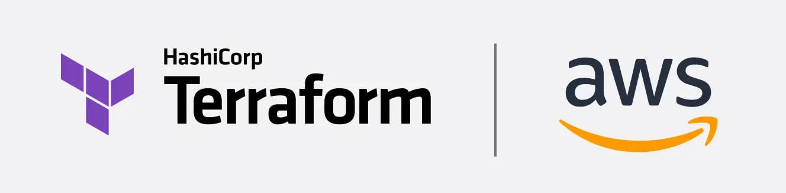

# Terraform on AWS – Practical Reference

> **Infrastructure-as-Code Reference**
> Opinionated Terraform **1.x** reference with a focus on **modern AWS infrastructure patterns and best practices**.

---

## 📌 Scope

This repository provides a structured Terraform reference for everyday AWS usage:

- Core Terraform workflow (`init`, `plan`, `apply`, `destroy`)
- State management & workspaces
- Variables, outputs, locals & validation
- Modules & reusable infrastructure patterns
- AWS provider usage and common resource types
- Modern Terraform 1.x best practices (remote state, environments, lifecycles)

It is not a “course” in the classic sense, but a **living reference** for real projects.

---

## 🧩 Supported Terraform Versions

- ✅ Recommended: **Terraform 1.x**
- ✅ Compatible: **Terraform ≥ 0.13** (HCL2-based)

> ⚠️ Some older commands/workflows (e.g. `terraform taint` as a primary workflow) are deprecated or discouraged in modern Terraform. This reference focuses on **Terraform 1.x style usage**.

---

## 🔐 AWS Credentials Configuration

### Windows (PowerShell)

```powershell
$env:AWS_ACCESS_KEY_ID="xxxxxxxxxxxxxxxxx"
$env:AWS_SECRET_ACCESS_KEY="yyyyyyyyyyyyyyyyyyyyyyyyyyyy"
$env:AWS_DEFAULT_REGION="eu-central-1"

```

### Linux / macOS (Shell)

```bash
export AWS_ACCESS_KEY_ID="xxxxxxxxxxxxxxxxx"
export AWS_SECRET_ACCESS_KEY="yyyyyyyyyyyyyyyyyyyyyyyyyyyy"
export AWS_DEFAULT_REGION="eu-central-1"
```

> ✅ **Best Practice:** Prefer using ~/.aws/credentials, named profiles and/or IAM roles (EC2, ECS, EKS) for real environments. Environment variables are fine for labs.

---

## ⚙️ Core Terraform Commands

```bash
terraform init        # Initialize working directory
terraform plan        # Show execution plan
terraform apply       # Apply infrastructure changes
terraform destroy     # Destroy managed infrastructure
```

### Additional Useful Commands

```bash
terraform fmt         # Format Terraform files
terraform validate    # Validate configuration syntax
terraform show        # Show current state or plan
terraform output      # Display output values
terraform console     # Interactive Terraform console
terraform import      # Import existing resources
```

---

## 📦 Terraform State Commands

```bash
terraform state list
terraform state show <RESOURCE>
terraform state pull
terraform state rm <RESOURCE>
terraform state mv <SOURCE> <DESTINATION>
```

### Example: Bulk State Move

```bash
for x in $(terraform state list | grep xyz); do \
  terraform state mv "$x" "$x"
done
```

> ⚠️ **Warning:** State operations are destructive. Always back up your state file before modifying it.

---

## 🧠 Terraform Workspaces

```bash
terraform workspace show
terraform workspace list
terraform workspace new <NAME>
terraform workspace select <NAME>
terraform workspace delete <NAME>
```

### Workspace Variable

```hcl
${terraform.workspace}
```

Used to differentiate environments such as `dev`, `test`, and `prod`.

---

## 🗂️ Recommended Project Structure

```text
.
├── main.tf
├── providers.tf
├── variables.tf
├── outputs.tf
├── versions.tf
├── terraform.tfvars
├── modules/
│   └── vpc/
└── README.md
```

---

## 🧩 Versions & Providers (Terraform 1.x)

```hcl
terraform {
  required_version = ">= 1.5.0"

  required_providers {
    aws = {
      source  = "hashicorp/aws"
      version = "~> 5.0"
    }
  }
}
```

---

## 🚀 Best Practices (Terraform 1.x)

- Use **remote backends** (S3 + DynamoDB) for state locking
- Always run `terraform fmt` and `terraform validate`
- Pin provider versions
- Use modules for reusable components
- Avoid hardcoding secrets
- Use `-target` only for exceptional cases

---

## 🧪 Core Concepts – Quick Examples

### Provider Definition

```hcl
provider "aws" {
  region = var.aws_region
}
```

### Variables

```hcl
variable "aws_region" {
  description = "AWS region"
  type        = string
  default     = "eu-central-1"
}
```

### Outputs

```hcl
output "instance_id" {
  value = aws_instance.web.id
}
```

### Local Values

```hcl
locals {
  env = terraform.workspace
}
```

### Resource Example (EC2)

```hcl
resource "aws_instance" "web" {
  ami           = "ami-0abcdef12345"
  instance_type = "t3.micro"

  tags = {
    Name = "web-${terraform.workspace}"
  }
}
```

### Data Source Example

```hcl
data "aws_ami" "amazon_linux" {
  most_recent = true
  owners      = ["amazon"]
}
```

### Module Usage

```hcl
module "vpc" {
  source = "./modules/vpc"
  cidr   = "10.0.0.0/16"
}
```

---

## 🧠 Next Level – Terraform in Real Projects

### Meta-Arguments: `count` and `for_each`

```hcl
resource "aws_instance" "servers" {
  count         = 2
  ami           = "ami-0abcdef12345"
  instance_type = "t3.micro"
}
```

```hcl
resource "aws_s3_bucket" "buckets" {
  for_each = toset(["dev", "test", "prod"])
  bucket   = "my-bucket-${each.key}"
}
```

---

### Resource Lifecycle

```hcl
resource "aws_instance" "safe" {
  ami           = "ami-0abcdef12345"
  instance_type = "t3.micro"

  lifecycle {
    prevent_destroy = true
    create_before_destroy = true
  }
}
```

---

### Explicit Dependencies

```hcl
resource "aws_instance" "app" {
  ami           = "ami-0abcdef12345"
  instance_type = "t3.micro"

  depends_on = [aws_s3_bucket.buckets]
}
```

---

### Conditional Logic

```hcl
resource "aws_instance" "conditional" {
  count = var.env == "prod" ? 1 : 0

  ami           = "ami-0abcdef12345"
  instance_type = "t3.medium"
}
```

---

### Variable Validation

```hcl
variable "env" {
  type = string

  validation {
    condition     = contains(["dev", "test", "prod"], var.env)
    error_message = "env must be dev, test, or prod"
  }
}
```

---

### Backend Configuration (S3 – Remote State)

```hcl
terraform {
  backend "s3" {
    bucket         = "terraform-states"
    key            = "project/terraform.tfstate"
    region         = "us-east-1"
    dynamodb_table = "terraform-locks"
    encrypt        = true
  }
}
```

---

### Workspaces + tfvars Pattern

```bash
terraform workspace new dev
terraform apply -var-file=dev.tfvars
```

```text
dev.tfvars
prod.tfvars
```

---

### Minimal Real-World Flow

```bash
terraform init
terraform fmt
terraform validate
terraform plan -out=tfplan
terraform apply tfplan
```

---

> ✅ This section reflects **real production Terraform usage** and aligns fully with **Terraform 1.x best practices**.
